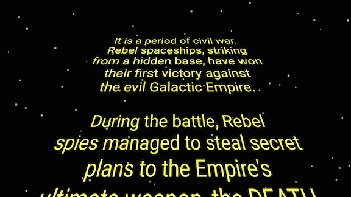

Star Wars opening crawl from 1977
===============

StarWars Opening crawl is an android app which tried to mimic the opening crawl from Episode IV.

It uses VectorDrawable support library for the starwars logo.
RadialGradient was used to draw stars in the galaxy.




Live Demo
-------------------------
[Live Demo] (https://appetize.io/app/g5qvjw3gm62ahf0mva50yx9bwg?device=nexus5&scale=75&orientation=landscape&osVersion=6.0)

Since it's a preview over a web browser, its performance is poor but you can easily check how the app looks like.

If you quickly want to try out on your device, the debug apk is available from [here] (https://github.com/Manabu-GT/StarWarsOpening/raw/master/apk/app-v1.0.0-debug.apk).

Requirements
-------------
API Level 19 (Kitkat) and above
(not due to technical limitations)

How to use
------------
Just click 'Start' button and enjoy!

How to build
-------------

```
./gradlew assembleDebug
```

Reference
-------------
[Star Wars opening crawl from 1977][1]

AppIcon
-------------
Thanks to [sensibleworld] 
(http://www.easyicon.net/language.ja/1185380-Darth_Vader_icon.html)

(Free for non-commercial use)

License
----------

    Copyright 2016 Manabu Shimobe

    Licensed under the Apache License, Version 2.0 (the "License");
    you may not use this file except in compliance with the License.
    You may obtain a copy of the License at

    http://www.apache.org/licenses/LICENSE-2.0

    Unless required by applicable law or agreed to in writing, software
    distributed under the License is distributed on an "AS IS" BASIS,
    WITHOUT WARRANTIES OR CONDITIONS OF ANY KIND, either express or implied.
    See the License for the specific language governing permissions and
    limitations under the License.

[1]: https://codepen.io/TimPietrusky/pen/eHGfj